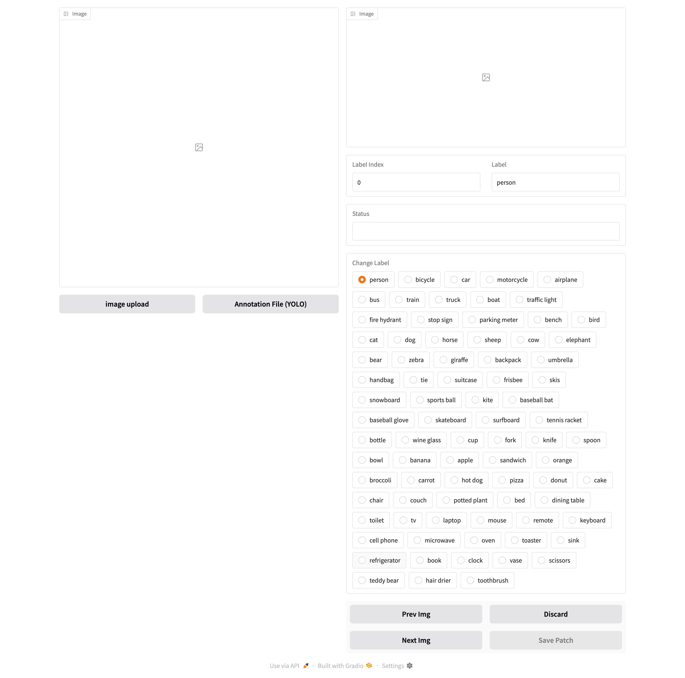

# FSLabeling Tool

FSLabeling is a labeling tool designed for creating and managing few-shot support sets using a Gradio-based user interface. This tool simplifies the process of annotating images and generating support sets for few-shot learning tasks.

## Web Interface



## Features

- **Image and Annotation Management**: 
    - Upload directories of images and YOLO-format annotation files.
    - Automatically match images with their corresponding annotations.

- **Interactive Annotation Viewer**:
    - View images with bounding boxes and labels overlaid.
    - Crop and display individual patches of annotated regions.

- **Label Editing**:
    - Modify labels interactively using a dropdown menu.
    - Update bounding box labels dynamically.

- **Navigation**:
    - Navigate through images and annotations using "Next" and "Previous" buttons.
    - Discard unwanted annotations.

- **Patch Saving**:
    - Save cropped patches and their labels into organized directories for further use.

## Installation

1. Clone the repository:
     ```bash
     git clone https://github.com/Guojiacheng2017/FSLabeling.git
     cd FSLabeling
     ```

2. Install dependencies:
     ```bash
     pip install cv2 gradio
     ```

3. Run the application:
     ```bash
     python evaluation_ui.py
     ```

## Usage

1. Launch the tool by running the script. A Gradio UI will open in your browser.
2. Upload a directory of images using the "Image Upload" button.
3. Upload a directory of YOLO-format annotation files using the "Annotation File (YOLO)" button.
4. Use the navigation buttons to browse through images and annotations.
5. Modify labels or discard annotations as needed.
6. Save cropped patches and labels for creating few-shot support sets.

## File Structure

- **`evaluation_ui.py`**: The main script for the Gradio-based labeling tool.
- **`LABEL`**: A dictionary mapping label indices to their corresponding class names.
- **`IMGLABEL`**: A class for managing images and annotations.
- **`EvaluationUI`**: A class for handling the Gradio UI and user interactions.

## Supported Formats

- **Image Formats**: `.jpg`, `.png`, `.bmp`, `.tiff`, `.webp`, and more.
- **Annotation Format**: YOLO-format text files.

## Contributing

Contributions are welcome! Feel free to open issues or submit pull requests to improve the tool.

## License

This project is licensed under the [MIT License](LICENSE).

## Acknowledgments

- Built with [Gradio](https://gradio.app/) for an interactive user interface.
- Inspired by the need for efficient labeling in few-shot learning tasks.
